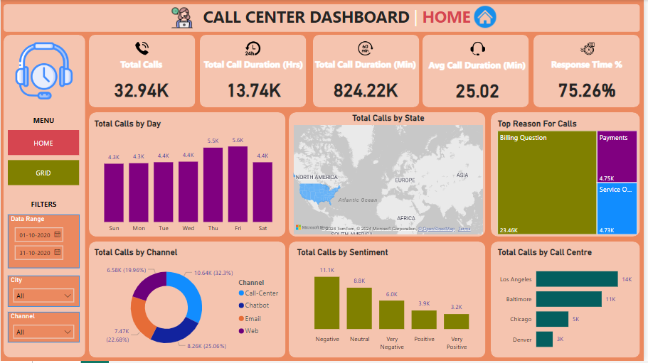
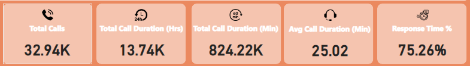
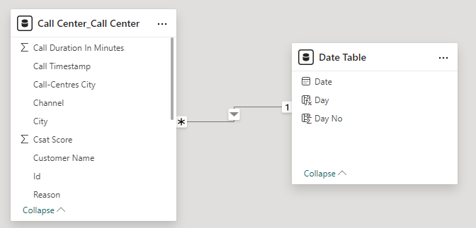
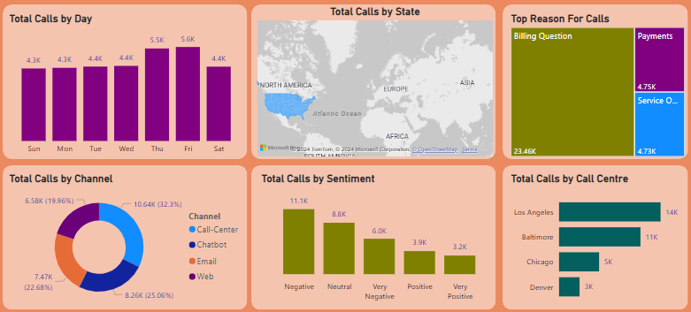
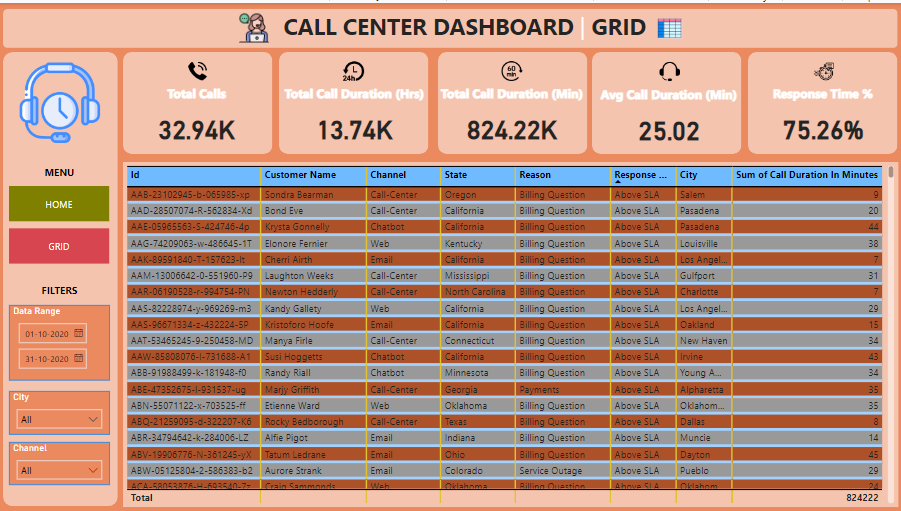

# CALL_CENTER_ANALYSIS

## INTRODUCTION

Welcome to the Call Center Performance Analysis Dashboard repository. This project involves a detailed analysis of call center data using Power BI to provide insights into various aspects of call center operations, including call volumes, agent performance, and customer satisfaction. The goal is to leverage data to optimize operations, enhance agent productivity, and improve customer service quality.

## PROBLEM STATEMENT

Welcome to the Call Center Performance Analysis Dashboard repository. This project involves a detailed analysis of call center data using Power BI to provide insights into various aspects of call center operations, including call volumes, agent performance, and customer satisfaction. The goal is to leverage data to optimize operations, enhance agent productivity, and improve customer service quality.

## TOOLS USED

- <u> EXCEL </u>  
Used Excel to convert unstructured data into a tabular format and created additional fields for deeper analysis.
- <u> POWER BI  </u>  
Used Power BI to design interactive reports and analyze data to provide insights to stakeholders.

## DATA SOURCE

This is dami data.  
Format of dataset file is csv file cantain 32,941 rows and 12 colums

## DATA CLEANING & PREPARATION

## DESIGNING & ANALYSIS 

### STEP 1

First we study the data properly by give a sufficient time on it.

### STEP 2

#### Calculate Key Performance Indicators (KPIs):

- <u> Total Calls </u>  
- <u> Total Call Duration(Hrs)  </u>  
- <u> Total Call Duration(Min) </u>  
- <u> Average Call Duration(Min) </u>  
- <u> Responce Time(%) </u>  

### STEP 3

Than used data MODELING 

### STEP 4

Than we visualiza a data by using different chart and we play around it to get some insight from it.

#### Visualize Data Through Various Charts:

- <u> Vartical BAR chart </u> = Total call by day  
- <u> Filled Map </u> = Total call by State   
- <u> Donut Chart  </u> =Total calls by channel   
- <u> Vertical Bar Chart </u> = Total call by santiments   
- <u> Horizontal Bar chart </u> = Total calls by call center  
- <u> Tree Map </u> = The Reason of calls   

### STEP 5

#### By analyzing these KPIs and visualizations, we aim to provide actionable insights that will help optimize business operations, enhance customer satisfaction, and drive sales growth. The insights gained will support data-driven decision-making and strategic planning for call center chains

 
 

|          HOME DASHBOARD                | 
:---------------------------------------:|
    

 
|          GRID DASHBOARD               |
:-------------------------------------------:
 
 

  

## CONCLUTION

The analysis of the call data reveals the following key insights:

- <u> Total Calls  </u> : 32.94K
- <u> Total Call Duration(Hrs) </u> : 13.74K
- <u> Total Call Duration(Min)  </u> : 824.22K
- <u> Average Call Duration(Min)  </u> : 25.02
- <u> Responce Time(%)  </u> : 75.26 %
- <u> Most of the call is track from Los Angelas call center
- <u> Most of the call are coming from negative sentiments of customers
- <u> Top reason of call is billing qutions
- <u> Busys day of week are Thusday & Friday for calling

#### Based on the analysis of the call center data, several key insights have emerged. The total number of calls is 32.94K, with a cumulative duration of 13.74K hours or 824.22K minutes, resulting in an average call duration of approximately 25.02 minutes. The response rate for these calls stands at 75.26%. The majority of these calls are tracked from the Los Angeles call center, with a significant portion of them stemming from negative customer sentiments. The primary reason for these calls is related to billing questions. Additionally, the busiest days for calls are Thursday and Friday.

## Recommendations:

Based on the analysis of the call center data, here are several recommendations to address the identified insights:

### 1. Improve Response Time: 
Since the current response rate is 75.26%, there is room for improvement. Implementing additional training or hiring more staff during peak hours, especially on Thursday and Friday, could help reduce wait times and improve overall response rates.

### 2. Address Billing Issues:
As billing questions are the top reason for calls, it would be beneficial to streamline and simplify the billing process. Providing clear, detailed billing statements and enhancing the FAQ section on the website can help reduce the number of billing-related inquiries.

### 3. Enhance Customer Sentiment: 
With a significant portion of calls stemming from negative sentiments, it's important to analyze the root causes of customer dissatisfaction. Conducting regular surveys and gathering feedback can help identify and address common pain points. Training staff in conflict resolution and empathy can also improve customer interactions.

### 4. Optimize Staffing for Peak Days: 
Since Thursday and Friday are the busiest days, ensure that the call center is adequately staffed on these days. Consider implementing flexible work schedules or temporary staffing solutions to handle the increased call volume.

### 5. Leverage Los Angeles Call Center: 
Given that most calls are tracked from the Los Angeles call center, ensure this location has the necessary resources and support to handle the high call volume. Investing in advanced call center technology and infrastructure can also improve efficiency and service quality.

By addressing these areas, the call center can improve its operational efficiency, enhance customer satisfaction, and reduce the volume of negative sentiment calls.
